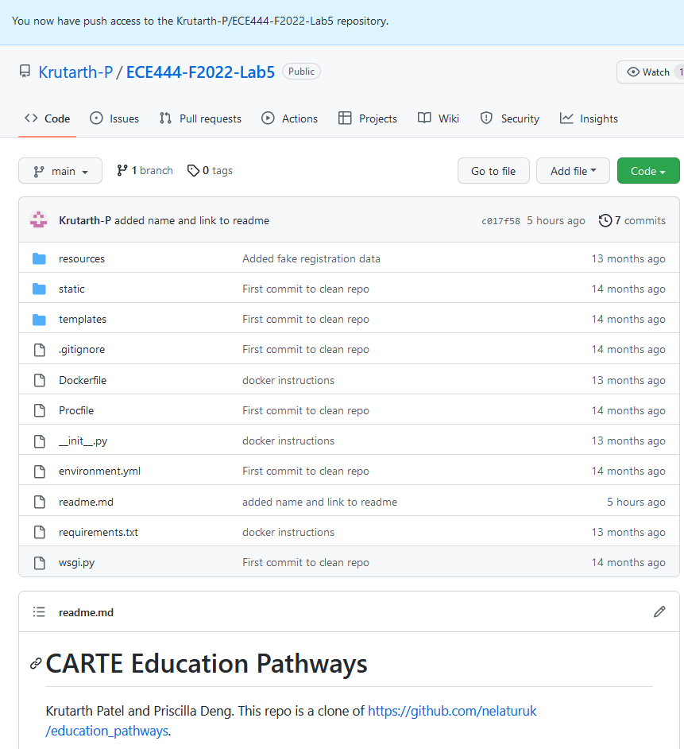
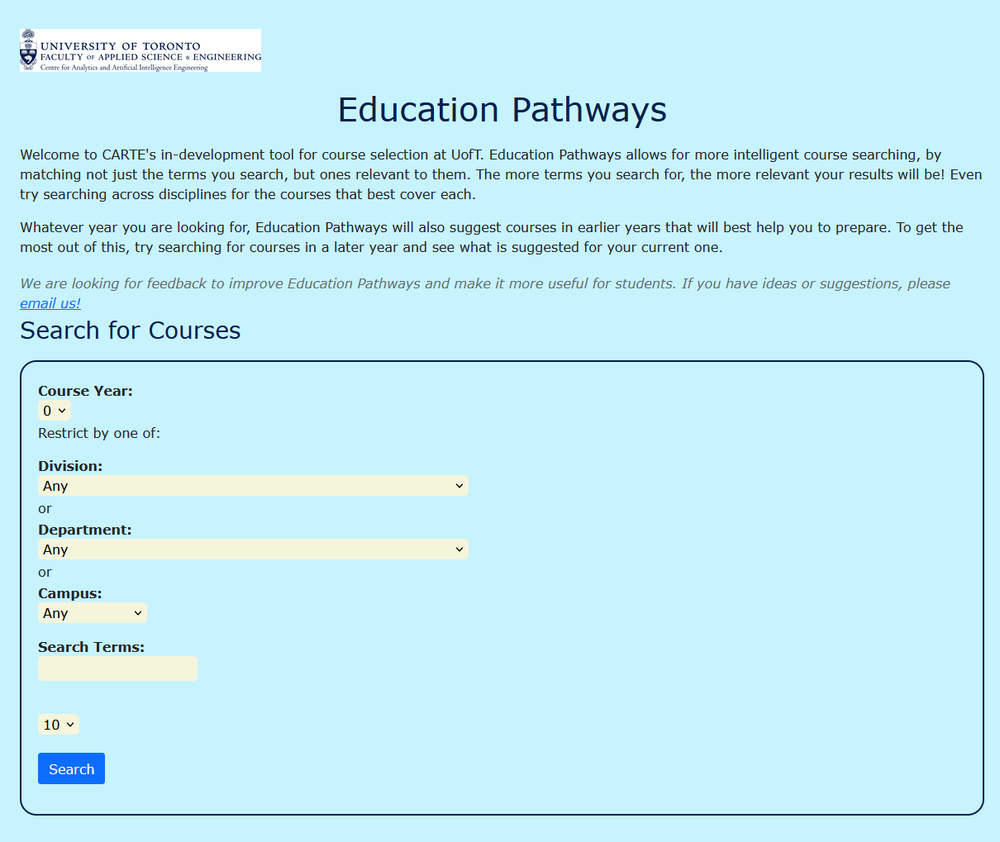
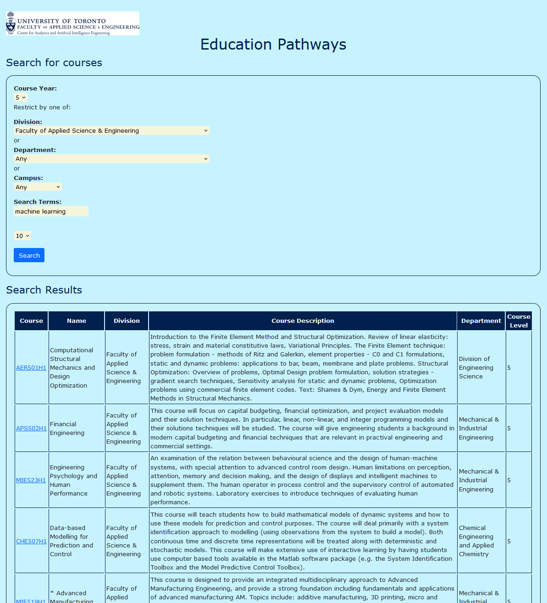
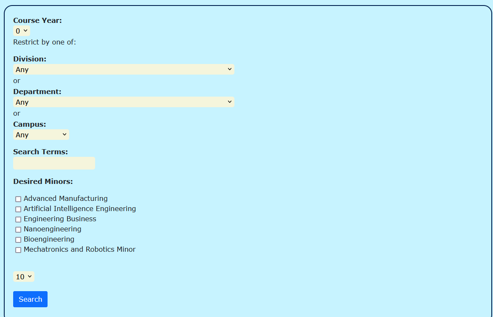
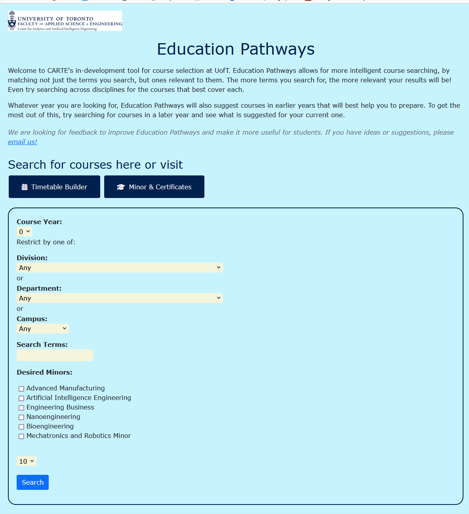
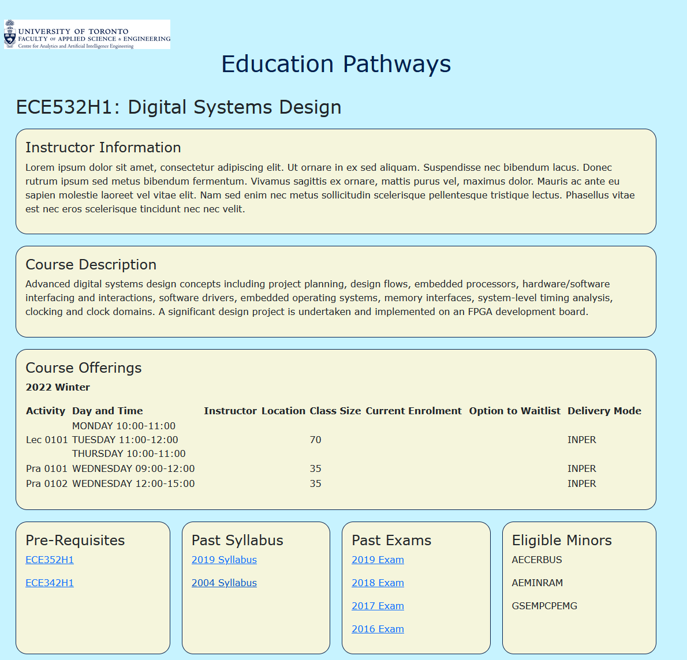

# CARTE Education Pathways
Krutarth Patel and Priscilla Deng. This repo is a clone of https://github.com/nelaturuk/education_pathways.

## Activity 1


## Activity 2-5
```
Screenshot of Home Page
```


```
Screenshot of Results Page (Forms & Table)
```


## Activity 6
```
User Story: As a student, I want to know which courses will contribute to specific minors so that I can easily stay informed and plan my courses to meet these minor requirements.
```


```
User Story: As a student, I want to easily access all main features (search, timetable builder, degree requirements) from the landing page so that I can use the application intuitively and efficiently.
```


```
User Story: As a student, I want to access detailed information for specific courses so that I can make the most informed decisions when choosing courses.
```

